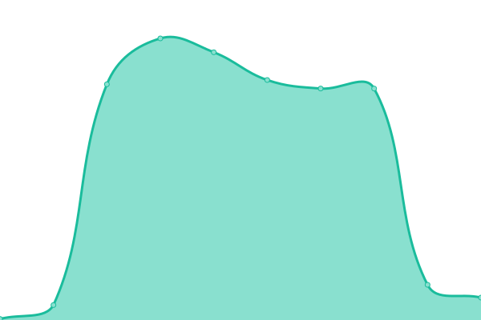
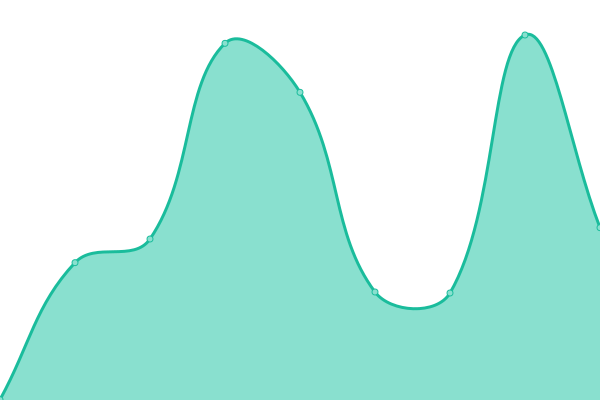

# [📈 Live Status](https://pukpuker.github.io/uptime): <!--live status--> **🟧 Partial outage**

This repository contains the open-source uptime monitor and status page for [Alexey](https://neverlose.store), powered by [Upptime](https://github.com/upptime/upptime).

With [Upptime](https://upptime.js.org), you can get your own unlimited and free uptime monitor and status page, powered entirely by a GitHub repository. We use [Issues](https://github.com/pukpuker/uptime/issues) as incident reports, [Actions](https://github.com/pukpuker/uptime/actions) as uptime monitors, and [Pages](https://pukpuker.github.io/uptime) for the status page.

<!--start: status pages-->
<!-- This summary is generated by Upptime (https://github.com/upptime/upptime) -->
<!-- Do not edit this manually, your changes will be overwritten -->
<!-- prettier-ignore -->
| URL | Status | History | Response Time | Uptime |
| --- | ------ | ------- | ------------- | ------ |
|  [gamesense.world](https://gamesense.world) | 🟩 Up | [gamesense-world.yml](https://github.com/pukpuker/uptime/commits/HEAD/history/gamesense-world.yml) | 

 266ms
     
 | 

<a href="https://pukpuker.github.io/uptime/history/gamesense-world">99.62%</a>
    

|  [neverlose.store](https://neverlose.store) | 🟩 Up | [neverlose-store.yml](https://github.com/pukpuker/uptime/commits/HEAD/history/neverlose-store.yml) | 

 291ms
     
 | 

<a href="https://pukpuker.github.io/uptime/history/neverlose-store">100.00%</a>
    

|  [onecrack.tech](https://onecrack.tech) | 🟥 Down | [onecrack-tech.yml](https://github.com/pukpuker/uptime/commits/HEAD/history/onecrack-tech.yml) | 

 152ms
     
 | 

<a href="https://pukpuker.github.io/uptime/history/onecrack-tech">2.72%</a>
    

|  [API](https://gamesense.world) | 🟩 Up | [api.yml](https://github.com/pukpuker/uptime/commits/HEAD/history/api.yml) | 

 111ms
     
 | 

<a href="https://pukpuker.github.io/uptime/history/api">99.64%</a>
    

|  [CDN](http://SOON) | 🟥 Down | [cdn.yml](https://github.com/pukpuker/uptime/commits/HEAD/history/cdn.yml) | 

 587ms
     
 | 

<a href="https://pukpuker.github.io/uptime/history/cdn">99.10%</a>
    

<!--end: status pages-->

[**Visit our status website →**](https://pukpuker.github.io/uptime)

## 📄 License

- Powered by: [Upptime](https://github.com/upptime/upptime)
- Code: [MIT](./LICENSE) © [Alexey](https://neverlose.store)
- Data in the `./history` directory: [Open Database License](https://opendatacommons.org/licenses/odbl/1-0/)
